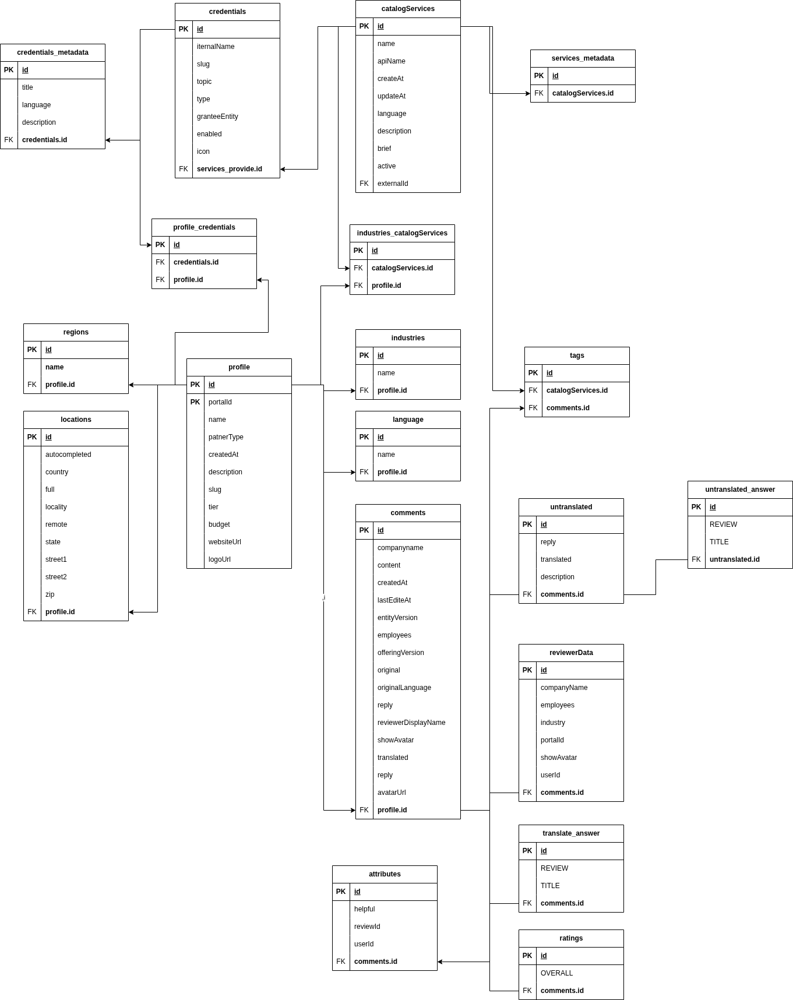

## Project Overview: Data Extraction and Data Lakehouse Creation

This project focuses on extracting data from the HubSpot ecosystem marketplace and utilizing it within a structured data framework. The primary objective is to extract relevant data from a specified website, store that data in a MongoDB database (creating a data lake), and then transform that data into a PostgreSQL database (establishing a data lakehouse). Additionally, the extracted data will be utilized to create a data cube for reporting purposes using Cube.dev.

### Project Structure

The project is organized into several key directories and files, each serving a specific purpose. Below is the breakdown of the project structure:

- **bad_script**: Contains an example Python script that may not follow best practices or intended functionality.
- **create_dwh.py**: A script responsible for creating the data warehouse.
- **database**: Directory potentially housing database-related files.
- **db_manipulation**: Scripts for connecting to databases and executing SQL commands.
    - **md_connect.py**: Module for connecting to MongoDB.
    - **pd_connect.py**: Module for connecting to PostgreSQL.
    - **sql_scripte**: Folder holding SQL scripts, including `table.sql`.
- **json_parsing**: This directory hosts scripts for parsing JSON and extracting data.
    - **catalog_parsing.py**: Script for parsing the catalog from the website.
    - **parsing_product_page.py**: Script dedicated to extracting data from product pages.
    - **comment.py**: Script for parsing comments from the data source.
    - **services_provide.py**: Handles service-related data extraction.
- **main.py**: The main entry point of the application.
- **requirements.txt**: Lists the necessary Python packages for the project.
- **README.md**: Project documentation file explaining setup and usage.
- **user_agents**: Contains scripts and data related to user agents used during web scraping.

### Functional Flow

1. **Data Extraction**: 
   - The project leverages Python scripts within the `json_parsing` directory to perform extraction from the HubSpot marketplace. Key scripts include `catalog_parsing.py` and `parsing_product_page.py`, which access the website, gather relevant data, and convert it into JSON format.

2. **Storing in MongoDB (Data Lake)**:
   - Extracted JSON data is then stored in a MongoDB database, forming a **data lake** where raw data is kept in its original format for future use.

3. **Data Transformation to PostgreSQL (Data Lakehouse)**:
   - The data lake is transformed into a PostgreSQL database using scripts from the `db_manipulation` directory. This layer acts as a **data lakehouse**, providing structured and relational representations of the data, including indexed tables for faster query performance.

4. **Building Data Cube**:
   - Using Cube.dev, a data cube is built from the PostgreSQL data, allowing for multidimensional analysis and complex aggregations.

5. **Reporting**:
   - Reports are generated leveraging the data from the cube, enabling insights and analytics based on the extracted data from the HubSpot marketplace.

### Conclusion
This project integrates web scraping, data storage, transformation, and reporting into a cohesive pipeline. By creating a data lake and subsequently a data lakehouse, it ensures that data is both accessible and easily analyzable, paving the way for informed decision-making and insights derived from the HubSpot ecosystem.


mongoDB database


postgreSQL data warehouse


---

# Run project

.env
```bash
db_name="hubspot"
db_user="!user_name!"
db_password="!password!"
db_port="5432" 
db_host="127.0.0.1"
mongo_url="mongodb://localhost:27017/"
```

Create environment and install packages
```
pip install -r requirements.txt
```

**Check connect to mongoDB**

### MongoDB

Create collection
```
db.createCollection("hubspot")
```

Add all data to mongo
```
python main.py
```

### PostgreSQL

Create table
[TABLES](https://github.com/bontonent/hubspot/blob/main_two/db_manipulation/sql_scripte/table.sql)

Add all data to postgres
```
python pd_connect.py
```

---

### How create cube with cube dev
https://mega.nz/folder/aYMBRJRK#cfRhW0DseHK2yxY5a9kOHw

### Final result

Created Analysts with cube
https://mega.nz/file/2N0kTKzZ#C6CfZjSuq6a-mH3yZy1DzPpAAoSq7tKkQmeEAUU35Iw
